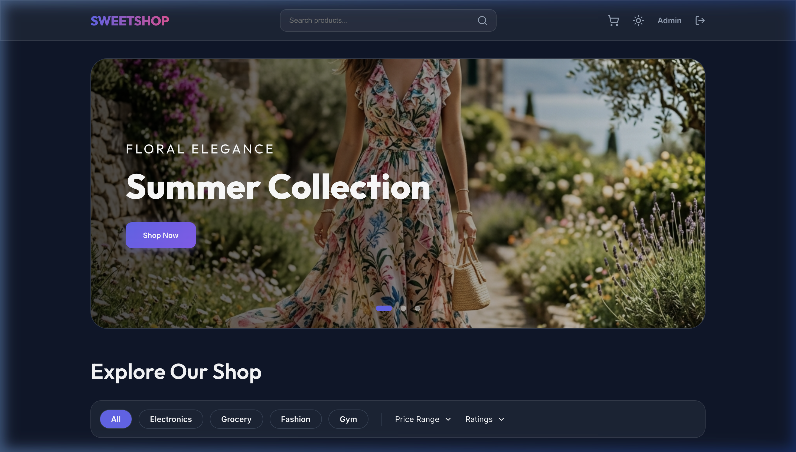
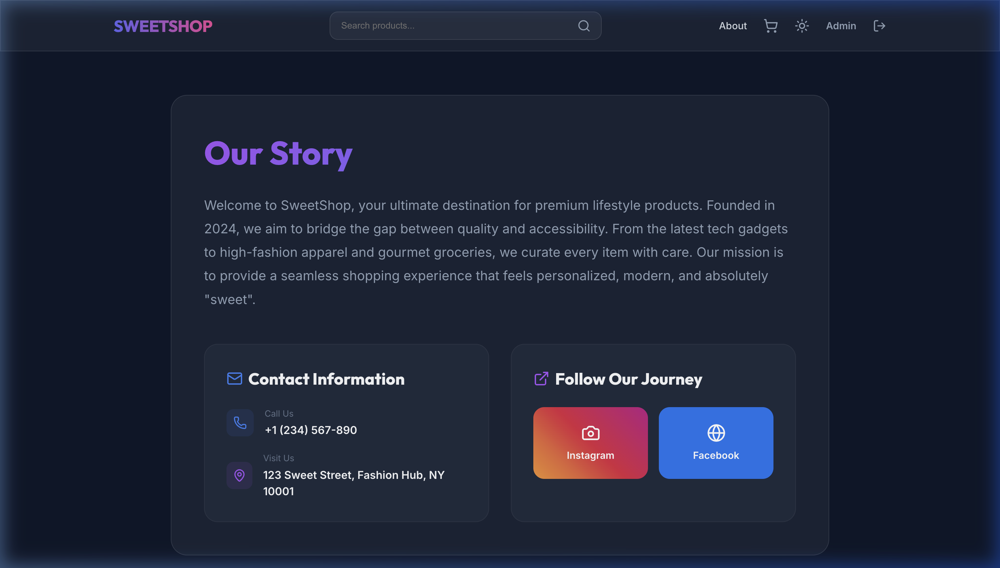
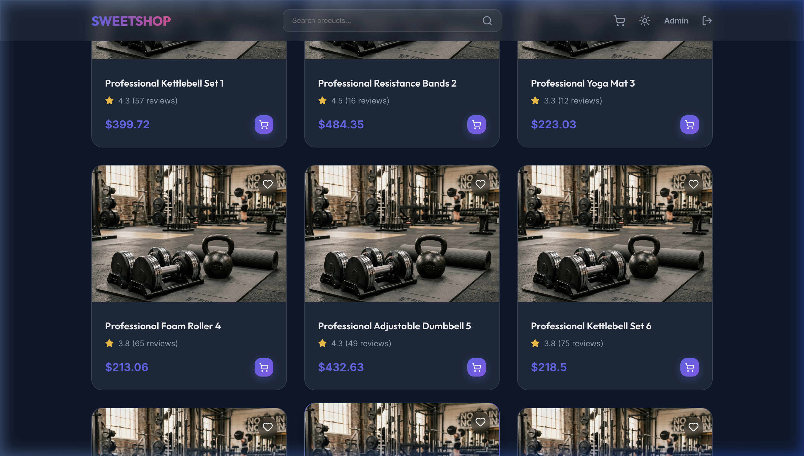

# 🍬 SweetShop - Premium MERN E-Commerce Platform



SweetShop is a modern, full-stack e-commerce application built with the MERN stack (MongoDB, Express, React, Node.js). It offers a premium shopping experience with a focus on high-quality visuals, seamless navigation, and a robust feature set across multiple categories including Fashion, Electronics, Gym Equipment, and Groceries.

---

## 🚀 Key Features

- **🛍️ Extensive Product Catalog**: Over 100+ unique products with professional AI-generated imagery.
- **🔍 Advanced Search & Filter**: Real-time keyword search and dynamic filtering by category, price, and ratings.
- **📱 Responsive Glassmorphism UI**: A sleek, dark-themed interface that works beautifully across all devices.
- **🛒 Dynamic Cart System**: Seamlessly add items to cart, manage quantities, and proceed to a multi-step checkout.
- **👤 User Authentication**: Secure login and registration with JWT-based sessions and profile management.
- **🛠️ Admin Dashboard**: Full control over products, orders, and user management for site administrators.
- **💳 Multi-step Checkout**: Integrated shipping, payment selection, and order placement workflow.
- **🌓 Dark/Light Mode**: Toggle between premium dark mode and classic light mode.

---

## 🛠️ Tech Stack

**Frontend:**
- **React 19** (Vite-powered)
- **Lucide React** (Modern Icons)
- **CSS3** (Custom Glassmorphism Design)
- **React Router 7** (Advanced Routing)

**Backend:**
- **Node.js** & **Express**
- **MongoDB** (Atlas) with **Mongoose**
- **JSON Web Token (JWT)** for Security
- **Bcrypt.js** for Password Hashing

---

## 📸 Preview

### **About Section**


### **Product Categories & Filtering**


---

## ⚙️ Installation & Setup

### **Prerequisites**
- Node.js installed
- MongoDB Atlas Account (or local MongoDB)

### **1. Clone the repository**
```bash
git clone https://github.com/pritamroman07-droid/E-Commers-Web.git
cd E-Commers-Web
```

### **2. Backend Setup**
```bash
cd backend
npm install
```
Create a `.env` file in the `backend` directory and add:
```env
MONGO_URI=your_mongodb_uri
JWT_SECRET=your_secret_key
NODE_ENV=development
```

### **3. Frontend Setup**
```bash
cd ../frontend
npm install
```

### **4. Seeding Data**
To populate the database with the initial 114 products:
```bash
cd ../backend
node seeder.js
```

### **5. Run the Application**
Start both servers simultaneously:
```bash
# In backend directory
npm run dev

# In frontend directory
npm run dev
```

---

## 📞 Contact

**Developer:** Pritam Maji (Roman)  
**Instagram:** [@i_am_roman_guy](https://www.instagram.com/i_am_roman_guy?igsh=bXRlNGR3dHRtbGhh)  
**Facebook:** [Roman Facebook](https://www.facebook.com/share/1HwRk3JPuo/)  
**Phone:** +91 78110 33493

---

© 2024 SWEETSHOP. All rights reserved.
